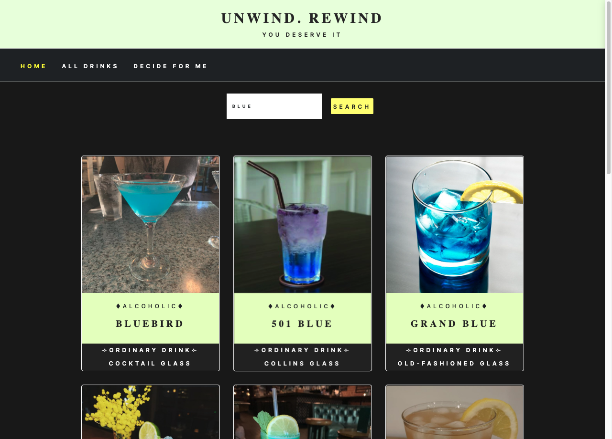
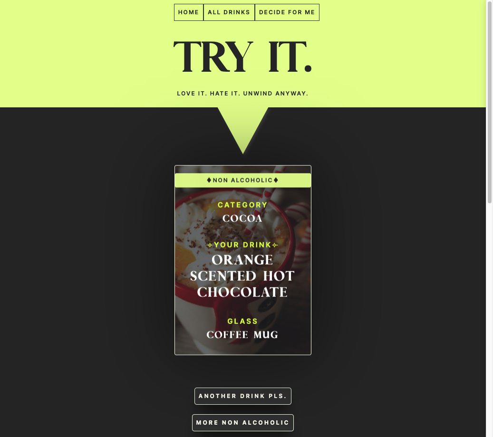

### Technologies Used

This application was built using Vanilla JavaScript, HTML, and CSS with the Bootstrap framework for styling. The CocktailDB API was used to retrieve drink recipes and display them in the application.

### Functionality 

The application has two main features: search functionality and a random drink generator.

The search functionality allows users to search for a drink recipe by name or ingredient. When a user inputs a search query, the application makes a request to the CocktailDB API and retrieves a list of drink recipes that match the query. The application then displays the drink recipes in a responsive grid layout with the drink name, image, and a button to view the recipe details.

The random drink generator ("pick for me" option) allows users to generate a random drink recipe by clicking a button. When the button is clicked, the application makes a request to the CocktailDB API and retrieves a random drink recipe. The application then displays the drink recipe details, including the name, image, ingredients, and instructions.

### API Usage
This application uses the CocktailDB API to retrieve drink recipes. The API is free to use and does not require an API key. However, if you plan to use the API for commercial purposes, you should check the API documentation for any restrictions or licensing requirements.

### Screenshots

